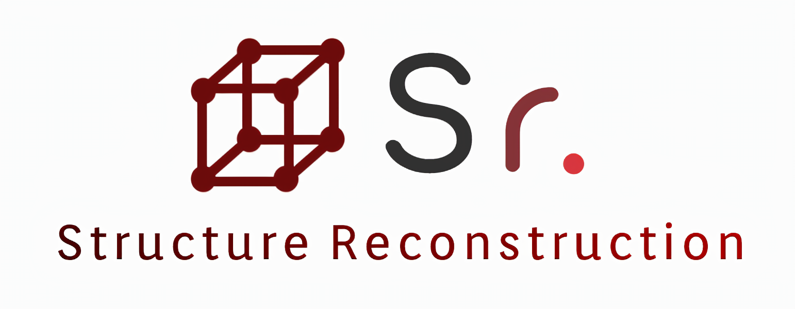
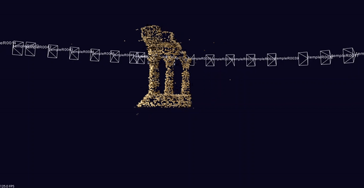
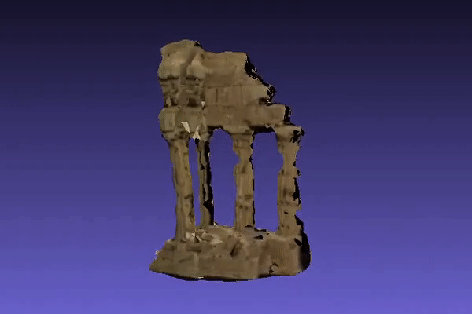
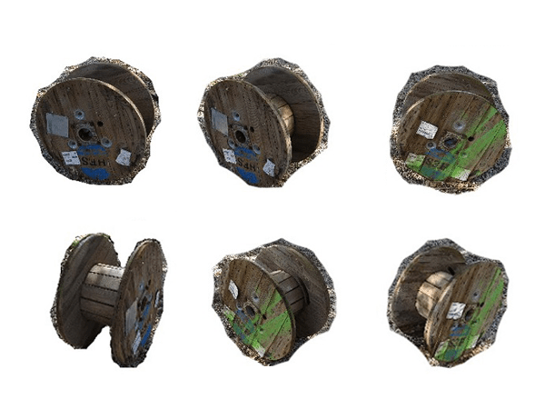
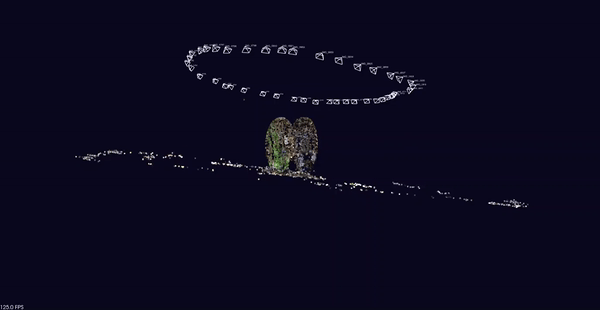

# Sr. | Structure Reconstruction
Sr. is a Structure from motion software:<br>
The software provide 3D Reconstruction and Camera Tracking.

# Examples
## Temple Ring (46 images)
#### by running: ./project.exe -f 1520.4 -s SomePath/TempleRing


## Wooden Spool (41 images)
#### by running: ./project.exe -f 2787.7 SomePath/WoodenSpool
The images were cropped to reduce computation time




# Required tools and libraries
- [CMake](https://cmake.org) for easier building: 
- [OpenCV compile with contrib modules](https://github.com/opencv/opencv_contrib) (Apache 2 License)
- [Ceres Solver](http://ceres-solver.org/installation.html) (BSD license)
- [Point Cloud Library (PCL)](https://pointclouds.org/downloads) (BSD license)
- [CGAL](https://www.cgal.org/download.html) (Open Source license)

# Build
- download the source code into some root folder "SomePath/Sr"
- create a build folder within the Sr directory: SomePath/Sr/Build
- Set "YOUR OWN" Build DIR dependency in CMakeList.txt
- run CMake configure within SomePath/Sr/Build as Build directory and SomePath/Sr as source directory
- run generate
- open visual studio solotion in SomePath/Sr/Build/Sr_Project.sln

# Usage
### Execute

```
Usage: ./project.exe [-h] [-v] [-s] [-d down_scale] [-c calib_directory] [-f focal_length] input_directory

Options:
      -h                  Print help message
      -v                  Show match
      -s                  Sort input images
      -d down_scale       Downscale factor for input images (decimal)
      -f focal_length     Camera focal length (decimal)
      -c calib_directory  Directory to find chess board images for camera calibration
      input_directory     Directory to find input images and calib.xml(optinal)
```

### Input Data

The pipline gets as input images of an object and intrinsic camera parameters, the pipeline creates colored point cloud and turns it into textured mesh.

Sr. gets an input directory containing images of an object from multiple views<br>
first option - using calib.xml:<br>
second option using - focal length:<br>
Note that intrinsic camera parameters must be named calib.xml!<br>
and be in the format:
```
<?xml version="1.0"?>
<opencv_storage>
<cameraMatrix type_id="opencv-matrix">
  <rows>3</rows>
  <cols>3</cols>
  <dt>d</dt>
  <data>fx 0 cx 0 fy cy 0 0 1</data></cameraMatrix>
<distortionCoefficients type_id="opencv-matrix">
  <rows>1</rows>
  <cols>5</cols>
  <dt>d</dt>
  <data>k1 k2 p1 p2 k3</data></distortionCoefficients>
</opencv_storage>
```
where:<br>
`fx, fy` are the focal length on the axis<br>
`(cx, cy)` is the principal point<br>
`k1, k2, p1, p2` and `k3` are the distortion coefficients
### Output Data
Sr. will create new folder in the input drictory named **output**, in this folder the software will crate several files:
- **PointCloud.ply** - Colored pointcloud of the object
- **occluded.jpg** - This images is used tp texture occluded part in the mesh
- **TexturMesh.mtl** - File containing information about the textuers matrials
- **TexturMesh.obj** - Textuerd mesh of the object
